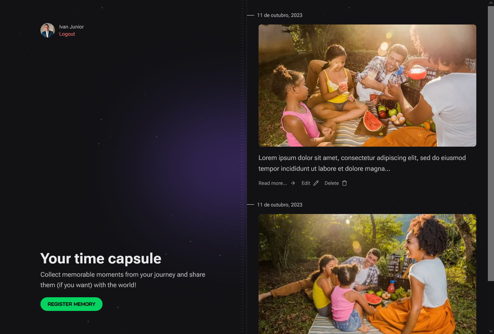

# SPACETIME APP

Register your memories and share them with the world!

This is just a project created for fun

### Tools used:

Server:
- Node.js
- Fastify
- Prisma
- Zod

Web:
- Next.js
- React
- Tailwind

### Instructions

- Clone this repository
- Navigate to 'web' folder and run ``npm install`` and ``npm run dev``
- Navigate to 'server' folder and run ``npm install`` and ``npm run dev``
- Open http://localhost:3000
- Login with your GitHub account
- Create a memory
- Have fun!

